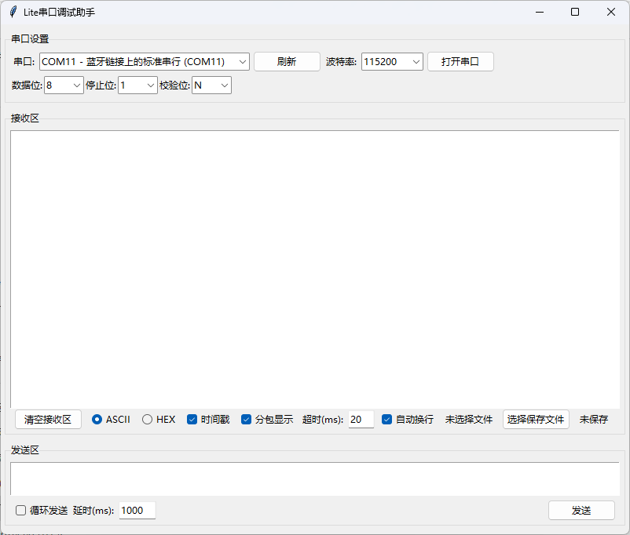

# Lite串口调试助手

一个简单易用的串口调试工具，支持数据收发、文件保存等功能。



## 功能特点

- 串口参数配置
  - 支持多种波特率选择（4800-1000000）
  - 可配置数据位、停止位、校验位
  - 自动检测可用串口
  - 实时刷新串口列表

- 数据接收功能
  - ASCII/HEX格式显示
  - 支持时间戳显示
  - 支持数据分包显示
  - 可配置接收超时时间
  - 支持自动换行
  - 数据保存到文件功能

- 数据发送功能
  - 支持单次发送
  - 支持循环发送
  - 可配置发送延时
  - 支持多行文本发送

- 界面功能
  - 清空接收区
  - 自动换行切换
  - 文件保存状态显示
  - 串口连接状态显示

## 安装要求

- Python 3.6+
- 依赖包：
  - pyserial
  - tkinter (Python标准库)

## 安装步骤

1. 克隆或下载本项目
2. 安装依赖包：
   ```bash
   pip install pyserial
   ```

## 使用方法

1. 运行程序：
   ```bash
   python serial_debugger.py
   ```

2. 串口设置：
   - 选择正确的串口
   - 设置波特率（默认115200）
   - 配置数据位、停止位、校验位
   - 点击"打开串口"按钮

3. 数据接收：
   - 选择显示模式（ASCII/HEX）
   - 可选择是否显示时间戳
   - 可选择是否启用分包显示
   - 设置接收超时时间
   - 可选择是否自动换行

4. 数据发送：
   - 在发送区输入要发送的数据
   - 点击"发送"按钮发送数据
   - 如需循环发送，勾选"循环发送"并设置延时时间

5. 数据保存：
   - 点击"选择保存文件"按钮
   - 选择保存位置
   - 数据会自动保存到文件中
   - 再次点击按钮可停止保存

## 构建可执行文件

### 方法一：使用打包脚本（推荐）

1. 确保已安装所需包：
   ```bash
   pip install pyinstaller
   pip install pyserial
   ```

2. 运行打包脚本：
   ```bash
   build.bat
   ```

3. 打包完成后，可执行文件将在 `dist` 文件夹中

### 方法二：直接使用 PyInstaller

1. 安装 PyInstaller：
   ```bash
   pip install pyinstaller
   ```

2. 运行打包命令：
   ```bash
   pyinstaller --name SerialDebugger ^
       --onefile ^
       --windowed ^
       --hidden-import serial.tools.list_ports ^
       --hidden-import serial.tools.list_ports_common ^
       --add-data "icon.ico;." ^
       --clean ^
       serial_debugger.py
   ```

3. 打包完成后，可执行文件将在 `dist` 文件夹中

### 注意事项

- 确保 Python 环境变量已正确设置
- 建议使用 Python 3.8 或更高版本
- 如果遇到权限问题，请以管理员身份运行
- 打包过程可能需要几分钟时间
- 生成的可执行文件大小约为 20-30MB

### 方法三：直接使用 `SerialDebugger.exe` 
已经构建的可以执行程序在 `dist` 文件夹中，可以直接运行 `SerialDebugger.exe`使用

## 注意事项

- 确保有正确的串口访问权限
- 发送数据前请确保串口已打开
- 循环发送时延时不能小于10ms
- 保存文件时请确保有写入权限

## 常见问题

1. 无法打开串口
   - 检查串口是否被其他程序占用
   - 检查串口权限设置
   - 确认串口参数设置正确

2. 数据接收异常
   - 检查波特率设置是否匹配
   - 确认数据位、停止位、校验位设置正确
   - 检查分包显示的超时设置

3. 文件保存失败
   - 检查文件路径是否有写入权限
   - 确认磁盘空间充足
   - 检查文件是否被其他程序占用

## 许可证

MIT License 